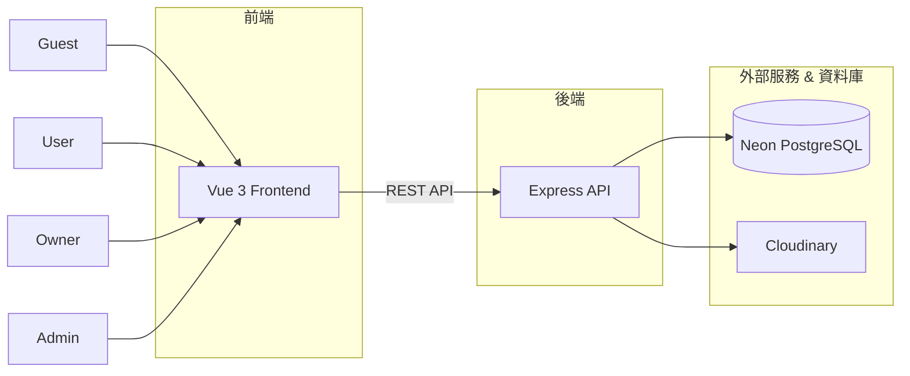
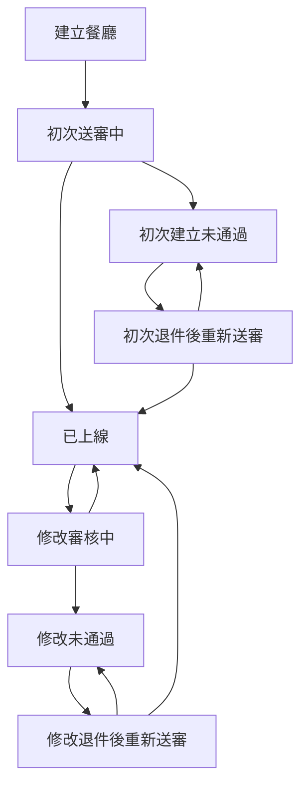

# Restaurant Review System

一個以 **Vue 3 + Express + Prisma + PostgreSQL** 開發的餐廳評論平台。

系統依據登入狀態與角色提供不同權限：

* 遊客（Guest，未登入狀態）
* 一般使用者（User）
* 業者（Owner）
* 管理員（Admin）

未登入訪客可瀏覽餐廳資訊、評分與評論內容；一般使用者可發表評論與評分、上傳評論圖片及管理個人資料；業者可建立與管理餐廳、回覆評論並查看營運數據；管理員則負責審核餐廳上架申請。

---

# Demo

### Frontend

https://restaurant-review-system-eta.vercel.app/

### Backend API

https://restaurant-review-api-3ali.onrender.com/

---

## Demo Accounts

### 一般使用者

帳號：user0@test.com

密碼：12345678

### 業者

帳號：owner0@biz.com

密碼：12345678

### 管理員

帳號：admin_0@biz.com

密碼：12345678

---


## Demo Data 說明

本專案展示畫面中的餐廳資料、評論資料與圖片，
主要來自 Seed Data 與示意資料，用於功能展示與開發測試。

部分餐廳名稱可能參考真實店家，
但不代表實際合作或真實營運資訊。

---

# 系統架構



---

# 資料庫 ERD


本系統採用 Prisma ORM + PostgreSQL。


---

# 系統截圖

## 首頁

* 餐廳列表
* 搜尋功能
* 排序功能


---

## 餐廳詳細頁

* 餐廳資訊
* 圖片燈箱
* 菜單圖片
* 評論區


---

## 業者 Dashboard

* KPI 指標
* 評論趨勢圖
* Top 5 餐廳評分排行


---

## 業者餐廳評分詳情頁

* **功能動線**：可從「業者 Dashboard」餐廳評分排行點擊「查看更多」導頁至此
* 完整的餐廳評分與排名數據列表


---

## 餐廳建立與送審


---

## 餐廳評論管理


---

## 管理員 Dashboard

* 待審核餐廳數


---

## 管理員審核頁


---

# 功能介紹

## 遊客（Guest，未登入狀態）

### 可使用功能

* 瀏覽餐廳列表
* 查看餐廳詳細資訊
* 查看餐廳評分
* 查看餐廳評論
* 搜尋餐廳
* 餐廳排序

### 無法使用

* 發表評論
* 評分餐廳
* 編輯評論
* 刪除評論

---

## 一般使用者（User）

### 帳號功能

* 註冊
* 登入
* 登出
* 編輯個人資料

### 評論功能

* 發表評論
* 編輯評論
* 刪除評論
* 上傳評論圖片

### 評分功能

* 1 ~ 5 星評分

### 限制

每位使用者對同一間餐廳只能評論一次

---

## 業者（Owner）

使用者可透過同意條款升級為業者。

### Dashboard

提供下列統計資訊：

* 餐廳數量
* 今日評論數
* 平均評分
* 待回覆評論數
* 回覆率
* 慢回覆率
* 平均回覆時間
* P50 回覆時間
* P90 回覆時間

### 圖表

#### 近 7 天評論趨勢

顯示每日評論數變化。

#### 餐廳評分排行（Top 5）

採用 Bayesian Rating 排名。

---

### 我的餐廳

可查看所有餐廳狀態。

支援：

* 建立餐廳
* 編輯餐廳
* 送出審核
* 下架餐廳
* 管理評論

---

### 餐廳評論管理

支援：

* 查看評論
* 篩選未回覆評論
* 評論排序
* 回覆評論
* 編輯回覆
* 刪除回覆

---

## 管理員（Admin）

### Dashboard

顯示：

* 待審核餐廳數量

---

### 餐廳審核

支援：

* 查看送審內容
* 通過審核
* 拒絕審核
* 填寫退件原因

---

# 餐廳審核流程



---

# Bayesian Rating

業者後台的餐廳排行採用 Bayesian Rating。

目的：

避免評論數過少的餐廳因單次高分而衝上排行榜。

計算方式：

```text
WR = (v / (v + m)) × R + (m / (v + m)) × C
```

其中：

| 變數 | 說明     |
| -- | ------ |
| R  | 餐廳平均評分 |
| v  | 評論數    |
| m  | 最低評論門檻 |
| C  | 全站平均評分 |

---

# Authentication & Security

## JWT Authentication

* Access Token：15 分鐘
* Refresh Token：7 天
* Refresh Token Rotation

---

## Cookie Security

使用：

* HttpOnly Cookie
* Secure Cookie

避免前端 JavaScript 存取 Token。

---

## RBAC

Role Based Access Control

依據登入狀態與角色提供不同權限：

* Guest（未登入）
* User
* Owner
* Admin

前後端皆進行權限驗證：

* 前端 Router Guard
* 後端 Authorization Middleware

---

# 圖片管理

使用 Cloudinary 作為圖片儲存服務。

支援：

* 餐廳封面圖片
* 餐廳展示圖片
* 菜單圖片
* 評論圖片

---

## 動態圖片轉換

前端根據 Cloudinary Public ID 動態產生不同尺寸圖片：

* Thumbnail
* Cover
* Viewer

降低圖片流量並提升載入速度。

---

## Lightbox 預載入

燈箱元件會預先載入圖片。

改善切換圖片時的等待時間。

---

# 技術亮點

## Draft / Publish 架構

餐廳修改不直接影響已上線資料。

所有修改會先建立 Draft。

審核通過後才同步至正式資料。

---

## Review Reply System

業者可回覆評論。

並可：

* 編輯回覆
* 刪除回覆

---

## Dashboard Analytics

提供：

* KPI 指標
* 評論趨勢
* 評分排行
* 回覆效率分析

---

## Dynamic Image Delivery

Cloudinary Public ID + Dynamic Transformation

支援不同情境下的最佳圖片尺寸。

---

# 技術棧

## Frontend

* Vue 3
* TypeScript
* Vue Router
* Pinia
* Axios
* Bootstrap 5
* ECharts
* Day.js
* Font Awesome
* Vue Toastify
* Vitest

---

## Backend

* Node.js
* Express
* TypeScript
* Prisma ORM
* PostgreSQL
* JWT
* Cookie Parser
* Cloudinary
* Winston

---

## Database

* PostgreSQL
* Neon

---

## Deployment

* Vercel
* Render
* Neon
* Cloudinary

---

# 本機安裝

## Clone

```bash
git clone https://github.com/goldsuraimu/restaurant-review-system.git

cd restaurant-review-system
```

---

## Frontend

```bash
cd frontend

npm install

npm run dev
```

---

## Backend

```bash
cd backend

npm install

npm run db:generate

npm run db:dev

npm run seed:dev

npm run dev
```

---

# Environment Variables

## Backend

建立：

```text
.env.development
.env.production
```

可參考：

```text
.env.development.example
.env.production.example
```

---

## Frontend

建立：

```text
.env.development
.env.production
```

可參考專案中的 example 檔案。

---

# Seed 注意事項

本專案 Seed 使用 Cloudinary Public ID。

Seed 並非純資料庫 Seed。

除了 PostgreSQL 外，

還需要於 Cloudinary 建立對應圖片資源。

---

若未建立對應圖片：

* 資料仍可正常建立
* 圖片將無法顯示

---

詳細格式請參考：

```text
backend/src/db/seeds/
```

---

# Testing

目前使用：

```text
Vitest
```

已撰寫測試：

* Pagination Logic
* Rating Tooltip Logic
* Star Rating Display Logic

---

# Deployment Notes

本專案部署於免費方案：

* Vercel
* Render
* Neon PostgreSQL

---

因此首次請求可能出現：

```text
5 ~ 30 秒冷啟動時間
```

屬於免費方案正常現象。

---

# Authentication Notes

由於：

* Frontend 部署於 Vercel
* Backend 部署於 Render

屬於跨網域部署。

因此 Cookie 設定採用：

```text
SameSite=None
Secure=true
```

以支援跨站驗證。

---

若未來部署於相同主網域：

例如：

```text
app.example.com
api.example.com
```

則可考慮改為：

```text
SameSite=Lax
```

或：

```text
SameSite=Strict
```

進一步提升安全性。

---

# 已知簡化項目

為聚焦於餐廳評論與審核流程設計，

以下功能未實作：

* Email 驗證
* 手機簡訊驗證
* OAuth 第三方登入

---

註冊時驗證：

* Email 格式
* Username 唯一性
* Email 唯一性

---

# 未來規劃

* Email 驗證
* OAuth Login（Google）
* 收藏餐廳
* 餐廳標籤系統
* 通知中心
* 更多 Dashboard 指標

---

# 備註

本專案為個人作品集展示用途。